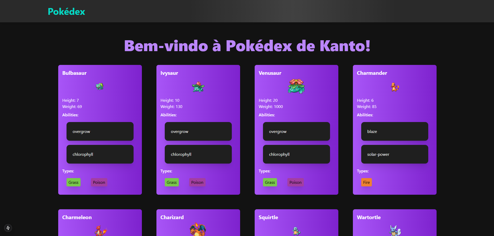

# Pokedex

Este é um projeto [Next.js](https://nextjs.org) criado com [`create-next-app`](https://nextjs.org/docs/app/api-reference/cli/create-next-app).

## Começando

Primeiro, instale as dependências:
```bash
npm install
```

Depois execute o servidor de desenvolvimento:

```bash
npm run dev
# ou
yarn dev
# ou
pnpm dev
# ou
bun dev
```

## IMG


